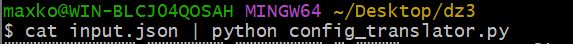
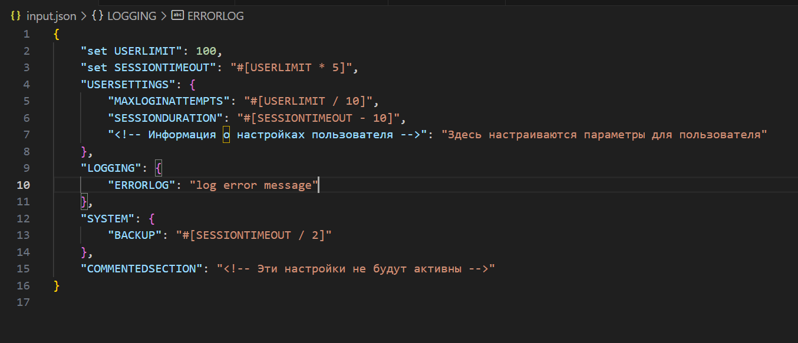
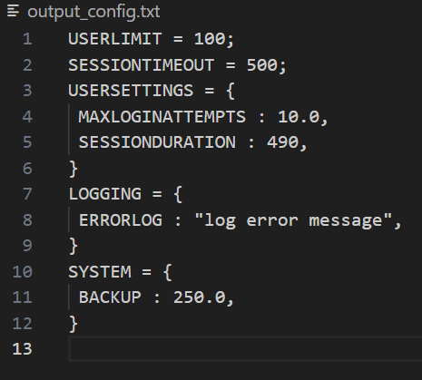
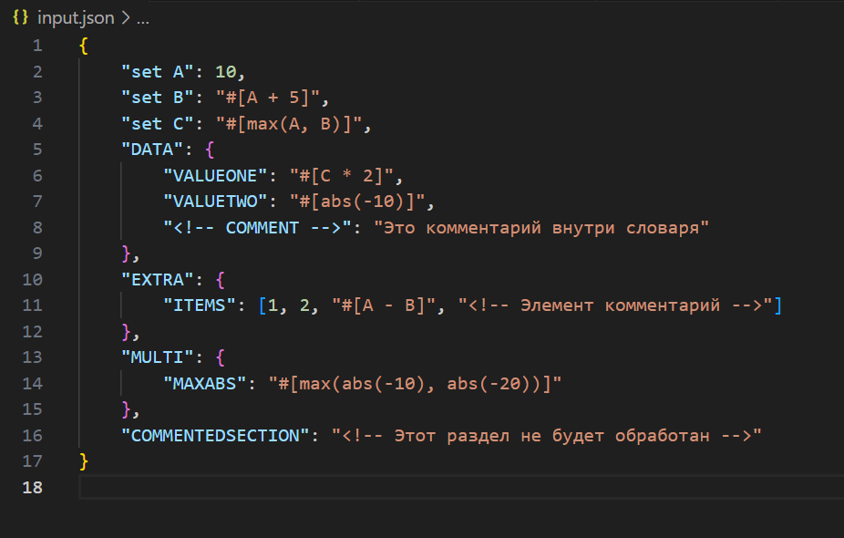
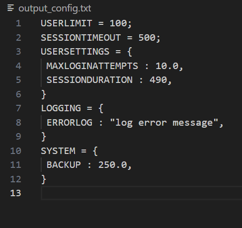
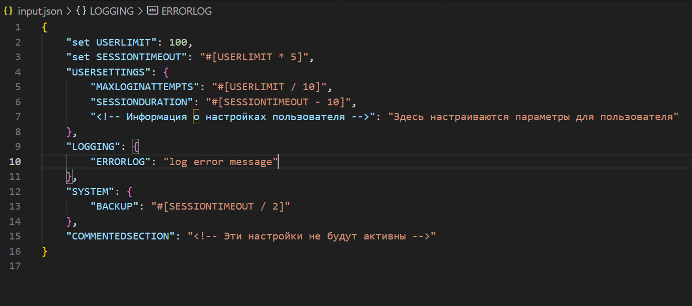
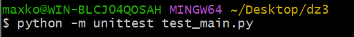
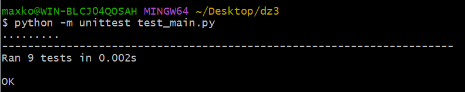

Задание №3 - 17 ВАРИАНТ

Разработать инструмент командной строки для учебного конфигурационного
языка, синтаксис которого приведен далее. Этот инструмент преобразует текст из
входного формата в выходной. Синтаксические ошибки выявляются с выдачей
сообщений.
Входной текст на языке json принимается из стандартного ввода. Выходной
текст на учебном конфигурационном языке попадает в стандартный вывод.
Многострочные комментарии:
<!--
Это многострочный
комментарий
-->
Словари:
{
 имя : значение,
 имя : значение,
 имя : значение,
 ...
}
Имена:
[A-Z]+
Значения:
• Числа.
• Словари.
Объявление константы на этапе трансляции:
86
set имя = значение;
Вычисление константного выражения на этапе трансляции (инфиксная
форма), пример:
#[имя + 1]
Результатом вычисления константного выражения является значение.
Для константных вычислений определены операции и функции:
1. Сложение.
2. Вычитание.
3. Умножение.
4. abs().
5. max().
Все конструкции учебного конфигурационного языка (с учетом их
возможной вложенности) должны быть покрыты тестами. Необходимо показать 2
примера описания конфигураций из разных предметных областей

Для запуска кода нужно прописать данную команду (находясь в директории с программой):

Пример входного файла:

Пример выходного файла:

2 примера описания конфигураций из разных предметных областей:

Пример 1: Конфигурация для математических вычислений (арифметика)

пример входного файла:

пример выходного файла:

Пример 2: 

пример входного файла:

пример выходного файла:

Также по заданию требовалось провести тесты. Результат запуска файла с тестами:

Для запуска требуется ввести команду:

Результаты тестирования:
